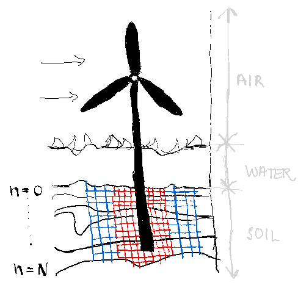

<!-- _class: title -->
<!-- _header: '_24.10.2024_' -->
# Optimize your curves, 
## (No gym required)

####
#### Oslo Python MeetUp
#### Sunniva Indrehus


--- 

<!-- paginate: true -->

```
echo $(whoami)
```
---


# Agenda

## Curve Fitting 
  - Why? 
  - What?
    - Example use cases  
  - How? 
    - Attention: how to deal with bounds
 

---


# Start with a data set coming in, with a known model, how does it look like? 

#TODO include picture of plot


---


> **Optimization**: an act, process, or methodology of making something (such as a design, system, or decision) as fully perfect, functional, or effective as possible 
specifically : the mathematical procedures (such as finding the maximum of a function) involved in this


> **Curve Fitting**: the empirical determination of a curve or function that approximates a set of data
<span style="display: block; text-align: right; font-style: italic; margin-top: 0.5rem;">*Merriam-Webster Dictionary*</span>

---

# What *is* Curve Fitting?

* Identify the **best-fit curve** for a dataset with a known model 
    * **Minimize** the difference between *observed* and *predicted* values
        $$ 
        \chi^2 = \sum_{i=1}^{N} \frac{(y_i^\text{obs} - y_i^\text{pred})^2}{\sigma_i^2} 
        $$
* Categories of problems  
    * Linear vs non-linear 
      $$ 
      y_1 = ax + b \qquad \text{vs} \quad y_2 = \sin(\omega t)\text{e}^{-x^2}
      $$
    * Constrained vs unconstrained
      $$
        a\in [-\infty,\infty] \quad \text{vs} \quad a \in [-\pi,\pi/3]
      $$


---

# Minimize the difference between *observed* and *predicted* values 


#TODO include illustrations
<!-- _class: split-text-image -->

<div class=ldiv>


*Figure credit: Radovan Bast*


</div>


<div class=rdiv>


*Figure credit: Radovan Bast*


</div>


--- 

# Real (work) life example 

<div class="twocols">


##

Monopile system 


<p class="break"></p>

###

Horizontal displacement curves under load

</div>


---

# Curve fitting vs. model optimization 

| Aspect              | Curve Fitting                                   | Model Optimization                              |
|:---------------------|:------------------------------------------------|:------------------------------------------------|
| **Scope**           | Specific; find a curve that fits data | Broad; enhance model performance in various contexts |
| **Applications**     | Scientific, engineering, and data analysis | Machine learning, operations research, statistics, etc. |
| **Techniques**      | Primarily uses least squares regression, polynomial fitting, non-linear fitting | Includes hyperparameter tuning, model selection, regularization, etc. |
| **Goal**            | Model relationships between variables through a curve | Improve performance across various model types |


---
<!-- _class: title -->
<!-- paginate: false -->
# :chart_with_upwards_trend: + :muscle: + :snake: = :question: 

--- 

<!-- _class: title -->
# :chart_with_upwards_trend: + :muscle: + :snake: = :heart: 

--- 


<!-- paginate: true -->

# Curve fitting in Python needs
  - Estimate of uncertainties and parameter correlations estimates
  - Easy change of the fitting algorithm 
    - Functionality for handeling parameter [bounds](https://lmfit.github.io/lmfit-py/bounds.html)
  


--- 

# Curve fitting in Python tool 


| **Topic**                        | **Details**                                                                         |
|:----------------------------------|:-------------------------------------------------------------------------------------|
| Library Name                 | `lmfit`                                                                             |
| GitHub Stars                 | :star: 1.1k                                                                              |
| Last Commit Date           | 13.10.2024 (on 22.10.2024)                                             |
| Description                  | High-level interface to non-linear optimization and curve fitting problems          |
| Built On                     | SciPy’s [`curve_fit`](https://docs.scipy.org/doc/scipy/reference/generated/scipy.optimize.curve_fit.html) |

---


# Tiling can improve the access pattern

<div class="twocols">


## Left 

<p class="break"></p>


## Right 
</div>


---

# Demo: Curve Fitting with `lmfit`**

### Step 1: Problem Setup

```python
import numpy as np
import matplotlib.pyplot as plt
from lmfit import Model

def model_function(x, a, b, c):
    return a * np.exp(-b * x) + c

x_data = np.linspace(0, 10, 100)
y_true = model_function(x_data, a=3, b=1, c=0.5)
noise = np.random.normal(0, 0.2, x_data.shape)
y_data = y_true + noise

plt.scatter(x_data, y_data, label='Noisy Data')
plt.plot(x_data, y_true, color='red', label='True Model')
plt.legend()
plt.show()
```

---

# Interpreting the Results

- **Parameter Estimates**: Best-fit values for `a`, `b`, and `c`
- **Fit Report**: Provides uncertainties and goodness-of-fit statistics
- **Visualization**: Compare the fitted model to the noisy data
- **Adding Constraints**:
  - Constrain parameters (e.g., `a > 0`)
- **Fitting Different Models**:
  - Experiment with other functions (e.g., polynomials, sine)
- **Advanced Features**:
  - Handle multiple datasets, parameter bounds, and more

---
<!--
class: center, middle
-->

# <div style="text-align: center;">:sparkles: :woman_technologist: Let's see some code :woman_technologist: :sparkles: </div>

