<!-- _class: title -->
<!-- _header: '_24.10.2024_' -->
<!-- paginate: false -->
# Optimize your curves
## (No gym required)

####
#### Oslo Python MeetUp
#### Sunniva Indrehus


---

<!-- _class: title -->
<!-- paginate: false -->
# :chart_with_upwards_trend: + :muscle: + :snake: = :question:

---

<!-- paginate: true -->

```
sunniva@ngi$ echo $(whoami)
```
---

# Problem

|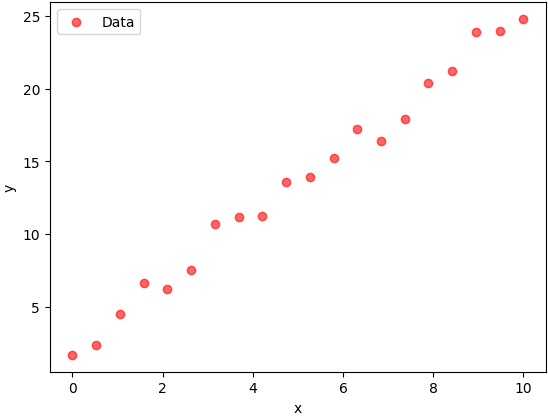|
|:--:|
|  |

---


> **Optimization**: an act, process, or methodology of making something (such as a design, system, or decision) as fully perfect, functional, or effective as possible
specifically : the mathematical procedures (such as finding the maximum of a function) involved in this


> **Curve Fitting**: the empirical determination of a curve or function that approximates a set of data
<span style="display: block; text-align: right; font-style: italic; margin-top: 0.5rem;">*Merriam-Webster Dictionary*</span>

---

# A solution

|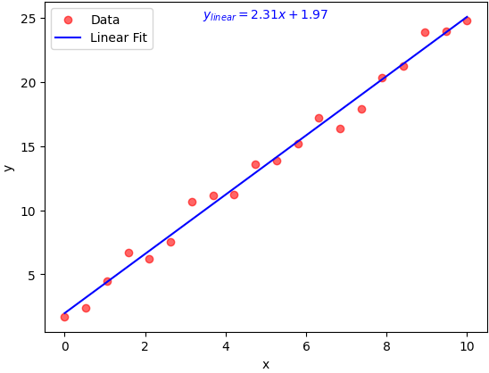|
|:--:|
|  |


---

# Another solution

|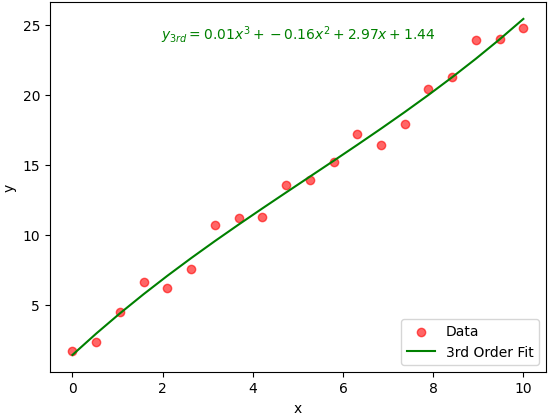|
|:--:|
|  |

---

# A third solution
|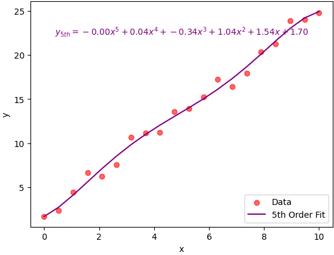|
|:--:|
|  |


---


# :exclamation: Choose your model :exclamation:
|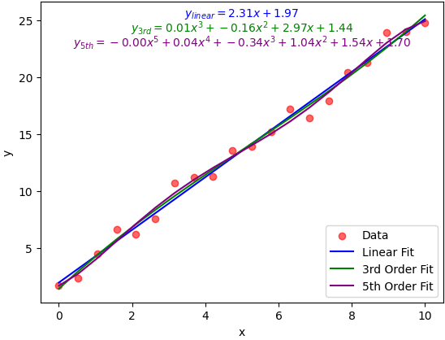|
|:--:|
|  |


---


<!-- _header: <br> <br> *Figure credit: PAGE, Ana M., et al. A macro-element pile foundation model for integrated analyses of monopile-based offshore wind turbines. Ocean Engineering, 2018, 167: 23-35.* -->

# Real (NGI work) life example

<div class="twocols">

| | |
|-----|-----|
|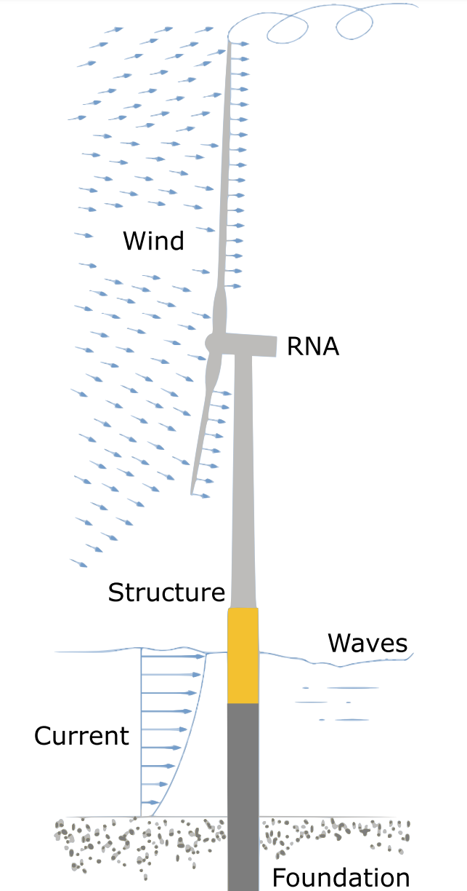||
| | |


<p class="break"></p>

<!-- 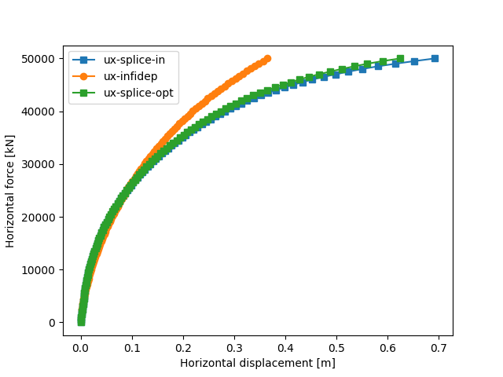
Horizontal displacement curves under load -->

</div>

---


<style>
  .image-container {
    display: flex;
    justify-content: center;
    align-items: center;
    border: 5px solid red; /* Frame color */
    padding: 0; /* Remove padding */
  }
</style>


<!-- _header: <br> <br> *Figure credit: PAGE, Ana M., et al. A macro-element pile foundation model for integrated analyses of monopile-based offshore wind turbines. Ocean Engineering, 2018, 167: 23-35.* -->

# Real (NGI work) life example

<div class="twocols">

| | |
|-----|-----|
|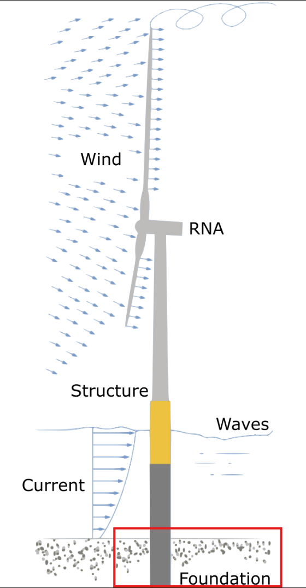|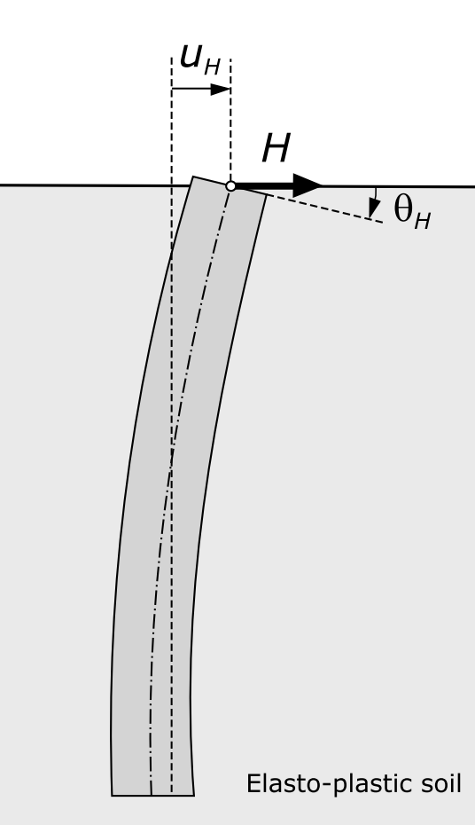|
| | |


<p class="break"></p>


Horizontal displacement curves under load

</div>

---

# What *is* Curve Fitting?

* Find the **best-fit curve** for a dataset using a known model
    * **Minimize** the difference between *observed* and *predicted* values
        $$
        \chi^2 = \sum_{i=1}^{N} \frac{(y_i^\text{obs} - y_i^\text{pred})^2}{\sigma_i^2}
        $$
* Categories of problems
    * Linear vs non-linear
      $$
      y_1 = ax + b \qquad \text{vs} \quad y_2= A \text{sin}(\omega x + \phi ) \text{e}^{-\gamma x^2 }
      $$
    * Unconstrained vs Constrained
      $$
        a\in [-\infty,\infty] \quad \text{vs} \quad a \in [-\pi,\pi/3]
      $$


---


# Difference between *observed* and *predicted* values


<div class="twocols">


##

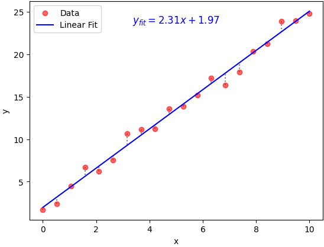


<p class="break"></p>

###
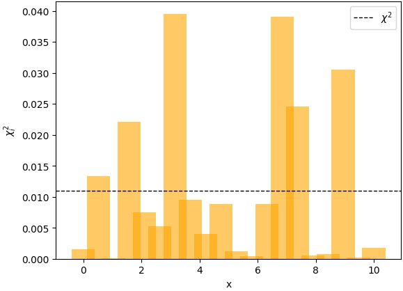

</div>


---

# Curve fitting requirements
- Estimate parameter uncertainties
- Support non-linear problem solving
- Easily change optimization algorithm
- Provide high-level tools for setting parameter [bounds](https://lmfit.github.io/lmfit-py/bounds.html)


---

# Recommended tool (by me)


| **Topic**                        | **Details**                                                                         |
|:----------------------------------|:-------------------------------------------------------------------------------------|
| Library Name                 | `lmfit`                                                                             |
| Description                  | High-level interface to non-linear optimization and curve fitting problems          |
| GitHub Stars                 | :star: 1.1k                                                                              |
| Last Commit Date           | 13.10.2024 (on 22.10.2024)                                             |
| Built On                     | SciPy’s [`curve_fit`](https://docs.scipy.org/doc/scipy/reference/generated/scipy.optimize.curve_fit.html) |

---


# A new non-linear problem

| |
|-----|
|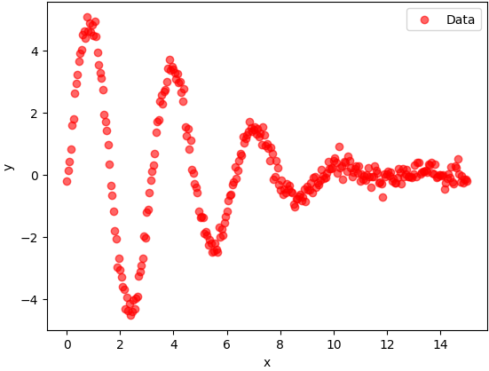|
| |


$$
y= A \text{sin}(\omega x + \phi ) \text{e}^{-\gamma x^2 }
$$

---

# <div style="text-align: center;">:sparkles: Let's see some code :sparkles: </div>

---

# Problem setup
```python
from lmfit import Minimizer, create_params

def residual(parameters, x, data):
    model = (
        parameters["amplitude"]
        * np.sin(x * parameters["omega"] + parameters["phi"])
        * np.exp(-x * x * parameters["gamma"])
    )
    return model - data

parameters_initial = create_params(
    amplitude=10,
    gamma=0.1,
    omega=3.0,
    phi=0.0,
)

minimizer = Minimizer(residual, parameters_initial, fcn_args=(x, data))
result = minimizer.minimize(method="least_squares")
```

---

# Handling bounds

```python
from lmfit import Parameters

params = Parameters()
params.add('amplitude', value=10, min=0)
params.add('gamma', value=0.1)
params.add('phi', value=0.0, min=-np.pi/2., max=np.pi/2.)
params.add('omega', value=3.0)

```

```python
from lmfit import create_params

params = create_params(amplitude=dict(value=10, min=0),
                       gamma=0.1,
                       omega=3,
                       phi=dict(value=0, min=-np.pi/2, max=np.pi/2))
```


---


# Interpret simulation results

```bash
[[Fit Statistics]]
    # fitting method   = least_squares
    # function evals   = 58
    # data points      = 301
    # variables        = 4
    chi-square         = 12.1867036
    reduced chi-square = 0.04103267
    Akaike info crit   = -957.236198
    Bayesian info crit = -942.407756
[[Variables]]
    amplitude:    5.03088066 +/- 0.04005821 (0.80%) (init = 10)
    gamma:  0.02495457 +/- 4.5396e-04 (1.82%) (init = 0.1)
    omega:  2.00026311 +/- 0.00326183 (0.16%) (init = 3)
    phi: -0.10264955 +/- 0.01022294 (9.96%) (init = 0)
[[Correlations]] (unreported correlations are < 0.100)
    C(omega, phi) = -0.7852
    C(amplitude, gamma)   = +0.5840
    C(amplitude, phi)   = -0.1179
```
---


# <div style="text-align: center;">:woman_technologist: [Demo](http://127.0.0.1:8888/notebooks/damped_sine_optimization.ipynb) :woman_technologist:  </div>

---

<!-- _class: title -->
# :chart_with_upwards_trend: + :muscle: + :snake: = :question:

---

<!-- _class: title -->
# :chart_with_upwards_trend: + :muscle: + :snake: = :heart:
